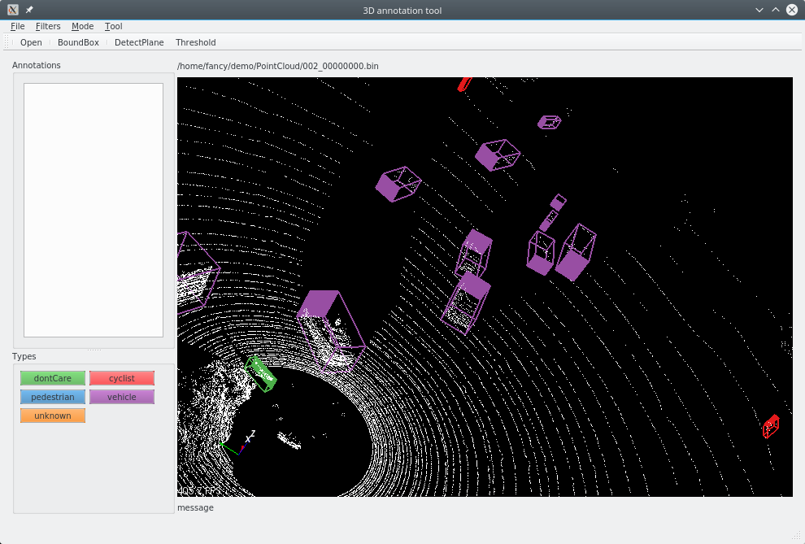
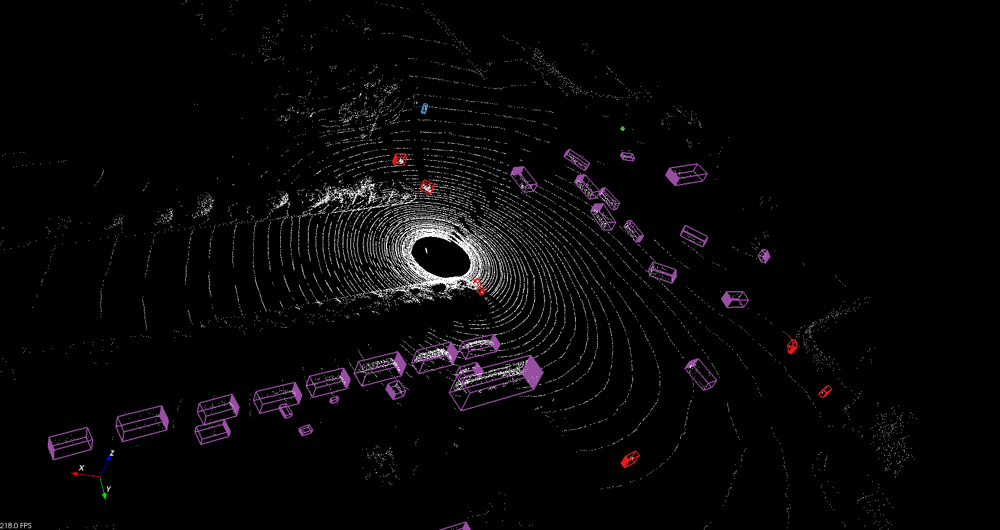

##  point cloud annotation tool
It is a tool used to annotate 3D box in point cloud. Point cloud in KITTI-bin format is supported. Annotation format is the same as Applo 3D format. Data examples can be found at [here](http://data.apollo.auto/help?name=data_intro_3d&data_key=lidar_obstacle_label&data_type=0&locale=en-us&lang=en).

### supported functions
- load, save, visiualize
- point cloud selection
- 3d box generation and adaption 
- ground remove using threhold or plane detect

### usage 
- if *cloud.bin* is open, then *cloud.bin.txt* will be the annotation file to be loaded if exist.
- click to select an annotaion, then edit it, rotate it or just press 'Del' to delete.
- 'x' to toggle selection mode,then left click with ctrl or shift to help select.
- click label button to annotate a 3D box.

### dependency
Tested with pcl 1.8, vtk 8.1, Qt5  under both ubuntu 16.04 and windows 10.

 