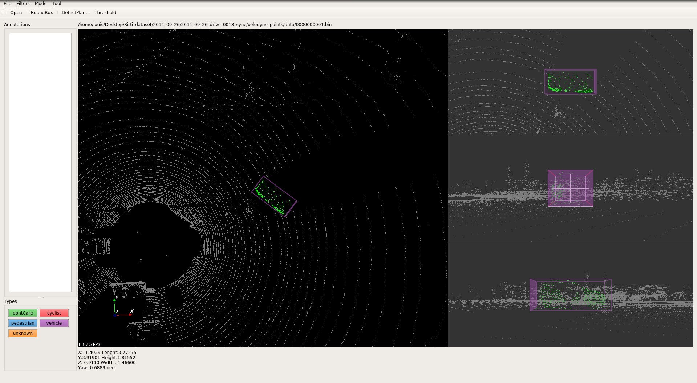

# [Point Cloud Annotation Tool](https://github.com/Louisgcr/point-cloud-annotation-tool)

##  point cloud annotation tool
It is a tool used to annotate 3D box in point cloud. Point cloud in KITTI-bin format is supported. Annotation format is the same as Applo 3D format. Data examples can be found at [here](http://data.apollo.auto/help?name=data_intro_3d&data_key=lidar_obstacle_label&data_type=0&locale=en-us&lang=en).




### supported functions
- load, save, visiualize
- point cloud selection
- 3d box generation
- ground remove using threhold or plane detect

### New Features
- 3 Additional camera view (top, front, side) that snaps to object
- Ability to move box object in any render window
- Added a full screen feature to toggle current render window and normal view
- Real time update of box details in message box below
- Points in boxs are highlighted green
- Box Opacity reduce to see through box 
- Lowered point intensity to see clearer

### usage 
- if *cloud.bin* is open, then *cloud.bin.txt* will be the annotation file to be loaded if exist.
- click to select an annotaion, then edit it, rotate it or just press 'Del' to delete.
- 'x' to toggle selection mode,then left click with ctrl or shift to help select.
- click label button to annotate a 3D box.

### additional usage
- ctrl + z to toggle full screen and selected render window


### dependency
Tested with pcl 1.8, vtk 8.1, Qt5  under both ubuntu 16.04 and windows 10.
to build:
```
mkdir build && cd build && cmake .. && make
```

## Authors
1. Louis Goh 
2. springzfx- Initial Work

##  Acknowledgement
1. Fancy Zhang

(Meow!!)  
.....\  
........_  
.....<(o )___  
......( .__> /  
........`-----'  

## License
[MIT](https://github.com/nishanths/license/blob/master/LICENSE)


